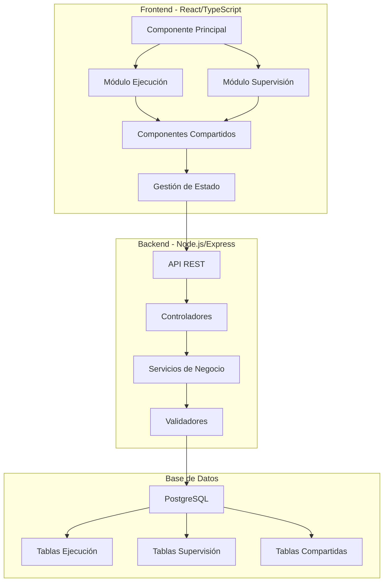
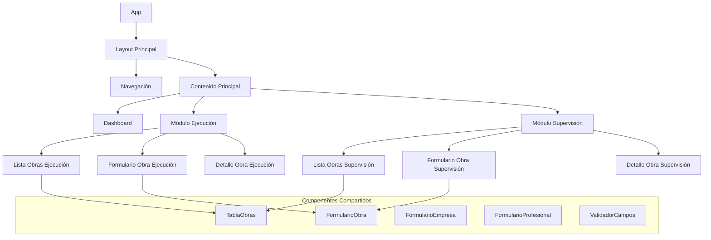
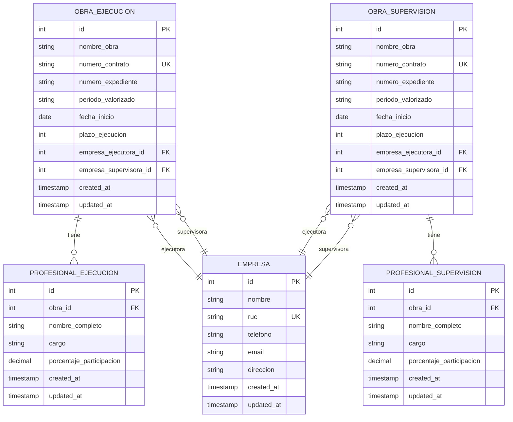

# Documento de Diseño - Control de Valorizaciones de Obras

## Visión General

El sistema de Control de Valorizaciones de Obras será una aplicación web moderna desarrollada con una arquitectura de cliente-servidor. La aplicación contará con dos módulos principales independientes (Ejecución y Supervisión) que compartirán componentes comunes pero mantendrán datos separados. El diseño priorizará la usabilidad, la integridad de datos y una experiencia de usuario moderna.

## Arquitectura

### Arquitectura General



### Stack Tecnológico

**Frontend:**
- React 18 con TypeScript
- Material-UI (MUI) para componentes de interfaz moderna
- React Hook Form para manejo de formularios
- React Query para gestión de estado del servidor
- React Router para navegación

**Backend:**
- Node.js con Express.js
- TypeScript para tipado estático
- Prisma ORM para acceso a base de datos
- Joi para validación de datos
- JWT para autenticación

**Base de Datos:**
- PostgreSQL para almacenamiento principal
- Redis para caché (opcional)

## Componentes y Interfaces

### Estructura de Componentes Frontend



### Interfaces de API REST

**Endpoints Principales:**

```typescript
// Obras de Ejecución
GET    /api/ejecucion/obras
POST   /api/ejecucion/obras
GET    /api/ejecucion/obras/:id
PUT    /api/ejecucion/obras/:id
DELETE /api/ejecucion/obras/:id

// Obras de Supervisión
GET    /api/supervision/obras
POST   /api/supervision/obras
GET    /api/supervision/obras/:id
PUT    /api/supervision/obras/:id
DELETE /api/supervision/obras/:id

// Empresas (compartidas)
GET    /api/empresas
POST   /api/empresas
GET    /api/empresas/:id
PUT    /api/empresas/:id

// Profesionales
GET    /api/obras/:id/profesionales
POST   /api/obras/:id/profesionales
PUT    /api/profesionales/:id
DELETE /api/profesionales/:id
```

## Modelos de Datos

### Esquema de Base de Datos



### Interfaces TypeScript

```typescript
interface Obra {
  id: number;
  nombreObra: string;
  numeroContrato: string;
  numeroExpediente: string;
  periodoValorizado: string;
  fechaInicio: Date;
  plazoEjecucion: number;
  empresaEjecutoraId: number;
  empresaSupervisoraId: number;
  empresaEjecutora?: Empresa;
  empresaSupervisora?: Empresa;
  profesionales: Profesional[];
  createdAt: Date;
  updatedAt: Date;
}

interface Empresa {
  id: number;
  nombre: string;
  ruc: string;
  telefono?: string;
  email?: string;
  direccion?: string;
  createdAt: Date;
  updatedAt: Date;
}

interface Profesional {
  id: number;
  obraId: number;
  nombreCompleto: string;
  cargo: string;
  porcentajeParticipacion: number;
  createdAt: Date;
  updatedAt: Date;
}

interface FormularioObraData {
  nombreObra: string;
  numeroContrato: string;
  numeroExpediente: string;
  periodoValorizado: string;
  fechaInicio: string;
  plazoEjecucion: number;
  empresaEjecutoraId: number;
  empresaSupervisoraId: number;
  profesionales: ProfesionalFormData[];
}

interface ProfesionalFormData {
  nombreCompleto: string;
  cargo: string;
  porcentajeParticipacion: number;
}
```

## Manejo de Errores

### Estrategia de Manejo de Errores

**Frontend:**
- Componente ErrorBoundary para capturar errores de React
- Notificaciones toast para errores de usuario
- Estados de carga y error en formularios
- Validación en tiempo real con mensajes específicos

**Backend:**
- Middleware global de manejo de errores
- Códigos de estado HTTP apropiados
- Mensajes de error estructurados y localizados
- Logging de errores para debugging

```typescript
interface ErrorResponse {
  success: false;
  error: {
    code: string;
    message: string;
    details?: any;
  };
}

interface SuccessResponse<T> {
  success: true;
  data: T;
  message?: string;
}
```

### Validaciones

**Reglas de Validación:**

1. **Campos Obligatorios:** Nombre obra, número contrato, número expediente, fecha inicio
2. **Unicidad:** Número de contrato debe ser único por módulo
3. **Fechas:** Fecha de inicio no puede ser futura
4. **Porcentajes:** Entre 0-100, suma total no mayor a 100%
5. **RUC:** Formato válido peruano (11 dígitos)
6. **Email:** Formato de email válido

## Estrategia de Testing

### Tipos de Testing

**Frontend:**
- Unit Tests: Componentes individuales con Jest y React Testing Library
- Integration Tests: Flujos completos de usuario
- E2E Tests: Cypress para pruebas de extremo a extremo

**Backend:**
- Unit Tests: Servicios y utilidades con Jest
- Integration Tests: Endpoints de API con Supertest
- Database Tests: Operaciones de base de datos

### Casos de Prueba Críticos

1. **Registro de Obra Completa:** Incluyendo empresas y profesionales
2. **Validación de Porcentajes:** Suma no exceda 100%
3. **Unicidad de Contratos:** Por módulo
4. **Navegación entre Módulos:** Independencia de datos
5. **Responsive Design:** Diferentes tamaños de pantalla
6. **Validaciones de Formulario:** Todos los campos requeridos

## Consideraciones de Diseño UX/UI

### Principios de Diseño

1. **Consistencia:** Mismos patrones de interacción en ambos módulos
2. **Claridad:** Separación visual clara entre módulos
3. **Eficiencia:** Formularios optimizados para entrada rápida de datos
4. **Retroalimentación:** Estados de carga, confirmaciones y errores claros
5. **Accesibilidad:** Cumplimiento con estándares WCAG 2.1

### Paleta de Colores y Tema

- **Primario:** Azul profesional (#1976d2)
- **Secundario:** Verde para ejecución (#388e3c), Naranja para supervisión (#f57c00)
- **Neutros:** Grises para texto y fondos
- **Estados:** Rojo para errores, Verde para éxito, Amarillo para advertencias

### Layout Responsivo

- **Desktop:** Sidebar con navegación, contenido principal amplio
- **Tablet:** Navegación colapsible, formularios adaptados
- **Mobile:** Navegación bottom tab, formularios en pasos

## Seguridad

### Medidas de Seguridad

1. **Autenticación:** JWT tokens con expiración
2. **Autorización:** Roles de usuario (admin, usuario)
3. **Validación:** Sanitización de inputs en frontend y backend
4. **CORS:** Configuración restrictiva para producción
5. **Rate Limiting:** Prevención de ataques de fuerza bruta
6. **Encriptación:** HTTPS en producción, passwords hasheadas

## Performance

### Optimizaciones

1. **Frontend:** Code splitting, lazy loading de módulos
2. **Backend:** Caching de consultas frecuentes, paginación
3. **Base de Datos:** Índices en campos de búsqueda frecuente
4. **Assets:** Compresión de imágenes, minificación de CSS/JS